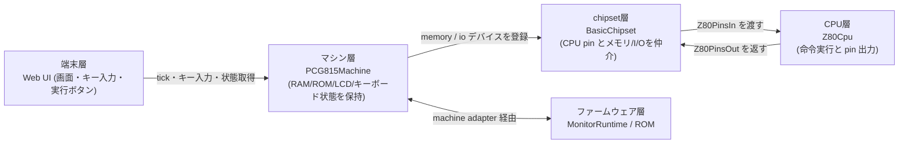
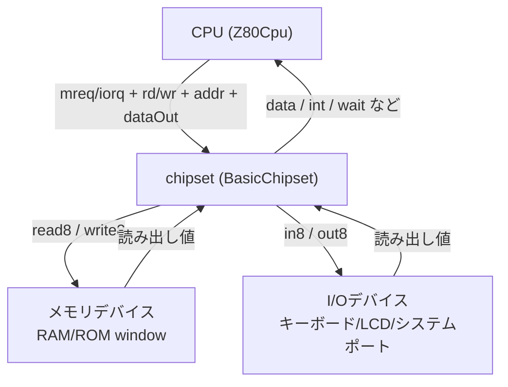
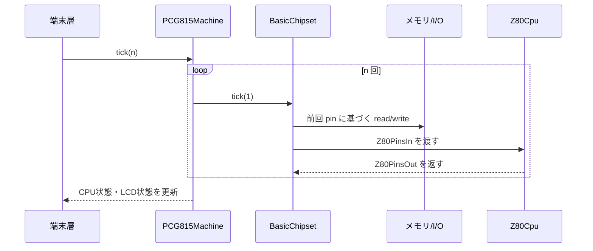

# PC-G815互換 エミュレータ ハードウェア層概要

この文書は、現在の実装で「どの層が何を担当し、どの線で繋がっているか」を、人間が追える言葉で説明するための概要です。  
対象は Web 版エミュレータです。

## 1. まず全体像

エミュレータの中では、次の順で責務を分けています。

1. 端末層: 画面を描き、キー入力を受ける
2. マシン層: RAM/ROM/LCD/キーボード状態を持つ
3. chipset層: CPU の pin 信号を読み解いて、メモリ/I/O に橋渡しする
4. CPU層: Z80 命令を 1T ずつ実行して pin 信号を出す

### `pin` とは何か

この文書でいう `pin` は、CPU の外に出ている「信号線」を意味します。  
実機のCPUチップにある足（ピン）を、ソフトウェア上でモデル化したものです。

ポイントは次の3つです。

1. CPU はメモリを直接読み書きしない  
   CPU は「このアドレスを読みたい」「このポートへ書きたい」という意図を、`mreq` / `iorq` / `rd` / `wr` / `addr` / `dataOut` で外へ出します。

2. 外側（chipset）が pin を見て実処理する  
   `BasicChipset` が pin 信号を読み取り、`read8` / `write8` / `in8` / `out8` を呼び出します。

3. 1Tごとに pin が変わる  
   命令は一気に終わるのではなく、T-state ごとに pin が遷移します。  
   この遷移を追えるようにすると、WAIT や割り込み受理タイミングを正確に再現できます。

### pin 信号一覧（早見表）

| 信号名 | 向き | 何を表すか | 主に使われる場面 |
|---|---|---|---|
| `addr` | CPU→外部 | 対象アドレス/ポート番号 | メモリ read/write、I/O read/write、命令フェッチ |
| `dataOut` | CPU→外部 | CPUが外へ書き出す1バイト値 | メモリ書き込み、I/O書き込み |
| `data` | 外部→CPU | CPUが外部から受け取る1バイト値 | メモリ読み出し、I/O読み出し、INT ACK |
| `mreq` | CPU→外部 | メモリアクセス要求 | 命令フェッチ、メモリ read/write |
| `iorq` | CPU→外部 | I/Oアクセス要求 | `IN` / `OUT`、INT ACK |
| `rd` | CPU→外部 | 読み取り動作 | メモリ読み出し、I/O読み出し、INT ACK |
| `wr` | CPU→外部 | 書き込み動作 | メモリ書き込み、I/O書き込み |
| `m1` | CPU→外部 | 命令フェッチ系サイクル | opcode fetch、INT ACK の先頭 |
| `rfsh` | CPU→外部 | リフレッシュサイクル | 命令フェッチ後半 |
| `wait` | 外部→CPU | 現在のバスサイクルを待たせる | 低速デバイス待ち合わせ |
| `int` | 外部→CPU | マスク可能割り込み要求 | 命令境界で受理判定 |
| `nmi` | 外部→CPU | ノンマスク割り込み要求 | 最優先割り込み |
| `reset` | 外部→CPU | CPUリセット要求 | 初期化、再起動 |
| `halt` | CPU→外部 | HALT状態で停止中か | 割り込み待ち状態 |
| `busrq` | 外部→CPU | バス使用権要求 | DMA相当のバス譲渡要求（将来拡張） |
| `busak` | CPU→外部 | バス使用権を譲渡中か | `busrq` への応答（将来拡張） |

## 2. 各層の責務

| 層 | 主コンポーネント | 主責務 | 下位層との接続 |
|---|---|---|---|
| 端末層 | Web UI（Canvas/Key入力/Editor） | 画面描画、キーイベント、実行操作 | `PCG815Machine` API を呼ぶ |
| マシン層 | `PCG815Machine` | RAM/ROM/LCD/Keyboard/I/Oレジスタ管理、スナップショット管理 | `BasicChipset` に memory/io を登録 |
| chipset層 | `BasicChipset` | CPU pin 解釈、メモリ/I/O ルーティング、INT/WAIT/RESET 等入力供給、read位相ラッチ、cycle trace 出力 | `Z80Core.tick()` を T-state 単位で駆動 |
| CPU層 | `Z80Cpu` | 命令デコード、timing定義テーブル参照、M/T サイクル進行、pin出力生成 | `Z80PinsIn/Out` 契約でのみ通信 |
| firmware層 | `MonitorRuntime` + ROM | BASIC/モニタ動作ロジック | machine adapter 経由でマシン資源を操作 |

## 3. 何がどこを通るか

### 3.1 メモリ読み書きの流れ

1. CPU が `mreq + rd` を出すと「メモリ読み取り要求」
2. chipset が read 開始位相でアドレスを見て `read8(addr)` を呼ぶ（同一 read 位相中はラッチ値を維持）
3. 読み出した値を `data` として CPU に返す
4. CPU が `mreq + wr` を出すと「メモリ書き込み要求」
5. chipset が `write8(addr, value)` を呼ぶ

### 3.2 I/O 読み書きの流れ

1. CPU が `iorq + rd` を出すと「I/O読み取り」
2. chipset が read 開始位相で `in8(port)` を呼ぶ（同一 read 位相中はラッチ値を維持）
3. CPU が `iorq + wr` を出すと「I/O書き込み」
4. chipset が `out8(port, value)` を呼ぶ

### 3.3 割り込みの流れ

1. マシン層が I/O レジスタ状態から「INT が必要か」を判断
2. chipset が次の `tick` 入力で `int=true` を CPU に渡す
3. CPU は命令境界で受理し、INT ACK サイクルへ入る

### 3.4 BUSRQ/BUSAK の流れ

1. 外部が `busrq=true` を入力
2. CPU はバス進行を停止して `busak=true` を返す
3. `busak=true` の間、CPU のバス制御線 (`m1/mreq/iorq/rd/wr/rfsh`) は不活性
4. `busrq=false` で解除すると命令進行を再開

## 4. 1T ごとに何が起きるか

`tick(1)` の最小単位で見ると、毎回ほぼ同じ手順を回します。

1. 前の T で出た pin を見て、必要ならメモリ/I/O に read/write を実行
2. `data/int/wait` など入力 pin を組み立てる
3. CPU に 1T 分 `tick(input)` を渡す
4. CPU が次の T で使う pin 出力を返す
5. 必要に応じて cycle trace フックへ当該 T の情報を通知する

## 5. 具体例: キー入力から画面更新まで

「A キーを押して、画面に文字が出る」までを簡単に追うと次の流れです。

1. 端末層がキー押下イベントを受ける  
2. マシン層のキーマトリクス状態が更新される  
3. CPU が I/O 読み取り命令でキーボードポートを読む  
4. chipset が `in8(port)` を呼び、キーマトリクス値を返す  
5. CPU/ランタイムが文字として処理し、LCD 用の I/O 書き込みを行う  
6. マシン層の LCD バッファが更新され、端末層が描画する  

## 6. 接続を理解するための最小用語

- `tick`: 1 ステップ進める呼び出し
- `T-state (1T)`: CPU の最小時間単位
- `pin`: CPU 外部信号（`mreq`, `iorq`, `rd`, `wr`, `data` など）
- `memory device`: RAM/ROM を読む・書く窓
- `io device`: ポート入出力を扱う窓
- `chipset`: pin 信号とデバイス呼び出しを変換する仲介層

## 7. この設計にした理由

1. CPU 実装とマシン実装を分離し、見通しを良くするため  
2. サイクル精度のテストを CPU 単体で書きやすくするため  
3. 将来、別のマシン構成に差し替えやすくするため

## 8. 実行ドメインと復帰契約

- 実行バックエンドは `z80-firmware`（既定）と `ts-compat`（保守用）を併存させています。
- 実行状態は `executionDomain` で管理します。
  - `firmware`: モニタ/ファームウェア領域
  - `user-program`: ユーザプログラム領域
- ASM実行の完了条件は「ファームウェア復帰点到達」です。
- 範囲外PC判定のようなヒューリスティックには依存しません。
