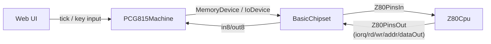

# PC-G815 I/Oポート仕様（現行エミュレータ実装準拠）

## 1. 概要
- 本書は、`PCG815Machine` の現行実装に基づく I/O ポート仕様書です。
- 目的は「人間が IN/OUT 処理を設計・実装できること」です。単なるポート一覧ではなく、副作用と状態遷移まで記述します。
- スコープは「エミュレータ実装準拠」です。実機の厳密仕様と差がある箇所は、未実装/暫定として明示します。

## 2. 背景
- CPU コア（`packages/core-z80`）は pin 駆動で、`IN/OUT` は `iorq/rd/wr/addr` pin で表現します。
- マシン依存の具体挙動（キーボード、LCD、システムポート）は `packages/machine-pcg815` に実装されています。
- 仕様の優先順位は次の通りです。
  1. `packages/machine-pcg815/src/machine.ts` の実装事実
  2. `packages/machine-pcg815/src/hardware-map.ts` の公開ポート定義
  3. CPU側前提は `docs/z80-cpu-spec-sheet.md`

### 2.1 pin信号と層接続の対応表

この章は、「I/Oポート操作が層をまたいでどのように流れるか」を一覧で確認するための対応表です。

| 起点 | 信号/呼び出し | 受け手 | 何が起きるか |
|---|---|---|---|
| CPU (`Z80Cpu`) | `iorq + rd + addr` | chipset (`BasicChipset`) | I/O読み取り要求として解釈される |
| chipset | `in8(port)` | マシン (`PCG815Machine`) | 対応ポートの入力値を計算して返す |
| マシン | 入力値（1byte） | chipset | 読み取りデータを返す |
| chipset | `data` pin | CPU | CPUが `IN` 命令の読み取り値として受け取る |
| CPU (`Z80Cpu`) | `iorq + wr + addr + dataOut` | chipset (`BasicChipset`) | I/O書き込み要求として解釈される |
| chipset | `out8(port, value)` | マシン (`PCG815Machine`) | 対応ポートのレジスタ更新/副作用を実行する |
| マシン | `interruptType`/`interruptMask` 等の状態 | chipset | 次の `tick` で `int` など入力pinに反映される |
| 端末層（Web UI） | `setKeyState`, `tick` | マシン | キー状態更新とCPU実行を進める |

補足:
- CPU はポート実装を直接持たず、必ず pin 信号経由で要求を出します。
- ポートごとの実処理（キーマトリクス、LCD、システムレジスタ）は `PCG815Machine` 側で実装されます。



## 3. 共通前提（リファレンス共通）

### 3.1 I/O バスと値の前提
- ポート番号は 8bit 正規化されます（`IN/OUT` の即値 `n`、`(C)` のどちらも下位 8bit が有効）。
- 入出力値も 8bit 正規化です。
- システムポートの `OUT` は実装上 `0x11..0x1F` が対象で、`0x10` と `0x1D` は dispatch されません。

### 3.2 キーボード前提
- キーマトリクスはアクティブローです。
  - `1`: 非押下
  - `0`: 押下
- `keyStrobe` はビットマスク方式で、`0x10` 読み出し時は「立っているビットの行」を OR 合成して返します。
- 実装上の行数は 8 行です（`keyboardRows[0..7]`）。

### 3.3 LCD 前提
- `0x57` / `0x5B` のデータ読み出しは、初回 `IN` で `0x00` を返し、その後に実データ読み出しへ進む動作です。
- LCD 制御コマンド（`0x50/0x54/0x58`）は `g815LcdCtrl` で解釈されます。
  - `0x40..0x7F`: X 設定
  - `0x80..0xBF`: Y 設定
  - `0xC0..0xFF`: 表示開始行設定（RAMワークエリア `0x790D` の下位 5bit 更新）

## 4. デバイス仕様（実装観点）

### 4.1 キーボード仕様
- 方式: 8行キーマトリクス + strobe 選択 + アクティブロー。
- 主な状態:
  - `keyboardRows[0..7]`: 行ごとの入力ビット（未押下=1、押下=0）
  - `keyStrobe` (`0x11`,`0x12`): どの行を読むかの選択マスク
  - `keyShift` (`0x13` 読み出し経路)
- 読み出し手順:
  1. `OUT (0x11),A` と `OUT (0x12),A` で strobe を設定
  2. `IN A,(0x10)` で選択行を合成読取
  3. 必要なら `CPL` して押下判定を正論理化
- 実装注意:
  - `0x13` は `keyStrobe` bit3 が立っている時だけ `keyShift` を返す。
  - `0x10` は複数行ビットが立っている場合、該当行を OR 合成して返す。

#### 4.1.1 キーマトリクス全対応表（`KEY_MAP` 全件）
- `bit(mask)` は行内列ビット（`1 << col`）。
- 行選択は `OUT 0x11/0x12` で `1 << row` を立てて指定。
- `normal` は Shift 非押下時に生成される文字コードです。
- `shifted` は Shift 押下時に生成される文字コードです。
- `normal`/`shifted` が空欄のキーは、文字コードを直接生成しない制御キーです（例: 矢印キー、Shift、CapsLock）。
- `normal`/`shifted` は「キー押下を受けて runtime へ投入される入力コード」を表します。  
  マトリクス読取（`IN 0x10`）の値そのものではありません。
- `normal`/`shifted` は、あくまでも文字コード変換を実装する時のための参考情報です。

実装時は次の順で使います。
1. 押したい行の strobe を `OUT 0x11/0x12` でセットする。
2. `IN 0x10` の結果を `bit(mask)` と照合して押下判定する（アクティブローなので `0` が押下）。
3. 文字入力を扱う場合は該当 `code` の `normal`/`shifted` を参照して文字コードに変換してください。

具体例:
- `Digit1` は `normal=0x31`（`'1'`）、`shifted=0x21`（`'!'`）。
- `Backspace` は `normal=0x08`。
- `ArrowLeft` は空欄で、押下は取れるが文字コードは生成しない。

| code | row | col | bit(mask) | normal | shifted |
|---|---:|---:|---:|---|---|
| `ShiftLeft` | 7 | 0 | 0x01 |  |  |
| `ShiftRight` | 7 | 1 | 0x02 |  |  |
| `Enter` | 7 | 2 | 0x04 | 0x0D |  |
| `Backspace` | 7 | 3 | 0x08 | 0x08 |  |
| `Space` | 7 | 4 | 0x10 | 0x20 |  |
| `ArrowUp` | 7 | 5 | 0x20 |  |  |
| `ArrowDown` | 7 | 6 | 0x40 |  |  |
| `ArrowLeft` | 7 | 7 | 0x80 |  |  |
| `ArrowRight` | 6 | 0 | 0x01 |  |  |
| `Digit0` | 6 | 1 | 0x02 | 0x30 | 0x29 |
| `Digit1` | 6 | 2 | 0x04 | 0x31 | 0x21 |
| `Digit2` | 6 | 3 | 0x08 | 0x32 | 0x40 |
| `Digit3` | 6 | 4 | 0x10 | 0x33 | 0x23 |
| `Digit4` | 6 | 5 | 0x20 | 0x34 | 0x24 |
| `Digit5` | 6 | 6 | 0x40 | 0x35 | 0x25 |
| `Digit6` | 6 | 7 | 0x80 | 0x36 | 0x5E |
| `Digit7` | 5 | 0 | 0x01 | 0x37 | 0x26 |
| `Digit8` | 5 | 1 | 0x02 | 0x38 | 0x2A |
| `Digit9` | 5 | 2 | 0x04 | 0x39 | 0x28 |
| `Minus` | 5 | 3 | 0x08 | 0x2D | 0x5F |
| `Equal` | 5 | 4 | 0x10 | 0x3D | 0x2B |
| `Comma` | 5 | 5 | 0x20 | 0x2C | 0x3C |
| `Period` | 5 | 6 | 0x40 | 0x2E | 0x3E |
| `Slash` | 5 | 7 | 0x80 | 0x2F | 0x3F |
| `KeyA` | 0 | 0 | 0x01 | 0x41 |  |
| `KeyB` | 0 | 1 | 0x02 | 0x42 |  |
| `KeyC` | 0 | 2 | 0x04 | 0x43 |  |
| `KeyD` | 0 | 3 | 0x08 | 0x44 |  |
| `KeyE` | 0 | 4 | 0x10 | 0x45 |  |
| `KeyF` | 0 | 5 | 0x20 | 0x46 |  |
| `KeyG` | 0 | 6 | 0x40 | 0x47 |  |
| `KeyH` | 0 | 7 | 0x80 | 0x48 |  |
| `KeyI` | 1 | 0 | 0x01 | 0x49 |  |
| `KeyJ` | 1 | 1 | 0x02 | 0x4A |  |
| `KeyK` | 1 | 2 | 0x04 | 0x4B |  |
| `KeyL` | 1 | 3 | 0x08 | 0x4C |  |
| `KeyM` | 1 | 4 | 0x10 | 0x4D |  |
| `KeyN` | 1 | 5 | 0x20 | 0x4E |  |
| `KeyO` | 1 | 6 | 0x40 | 0x4F |  |
| `KeyP` | 1 | 7 | 0x80 | 0x50 |  |
| `KeyQ` | 2 | 0 | 0x01 | 0x51 |  |
| `KeyR` | 2 | 1 | 0x02 | 0x52 |  |
| `KeyS` | 2 | 2 | 0x04 | 0x53 |  |
| `KeyT` | 2 | 3 | 0x08 | 0x54 |  |
| `KeyU` | 2 | 4 | 0x10 | 0x55 |  |
| `KeyV` | 2 | 5 | 0x20 | 0x56 |  |
| `KeyW` | 2 | 6 | 0x40 | 0x57 |  |
| `KeyX` | 2 | 7 | 0x80 | 0x58 |  |
| `KeyY` | 3 | 0 | 0x01 | 0x59 |  |
| `KeyZ` | 3 | 1 | 0x02 | 0x5A |  |
| `Semicolon` | 3 | 2 | 0x04 | 0x3B | 0x3A |
| `Quote` | 3 | 3 | 0x08 | 0x27 | 0x22 |
| `BracketLeft` | 3 | 4 | 0x10 | 0x5B | 0x7B |
| `BracketRight` | 3 | 5 | 0x20 | 0x5D | 0x7D |
| `Backslash` | 3 | 6 | 0x40 | 0x5C | 0x7C |
| `Backquote` | 3 | 7 | 0x80 | 0x60 | 0x7E |
| `IntlYen` | 3 | 6 | 0x40 | 0x5C | 0x7C |
| `IntlRo` | 5 | 3 | 0x08 | 0x5C | 0x5F |
| `Tab` | 4 | 0 | 0x01 | 0x09 |  |
| `Escape` | 4 | 1 | 0x02 | 0x1B |  |
| `Delete` | 4 | 2 | 0x04 | 0x08 |  |
| `Insert` | 4 | 3 | 0x08 |  |  |
| `CapsLock` | 4 | 4 | 0x10 |  |  |
| `KanaMode` | 4 | 5 | 0x20 |  |  |
| `Convert` | 4 | 6 | 0x40 |  |  |
| `NonConvert` | 4 | 7 | 0x80 |  |  |
| `Numpad0` | 6 | 1 | 0x02 | 0x30 |  |
| `Numpad1` | 6 | 2 | 0x04 | 0x31 |  |
| `Numpad2` | 6 | 3 | 0x08 | 0x32 |  |
| `Numpad3` | 6 | 4 | 0x10 | 0x33 |  |
| `Numpad4` | 6 | 5 | 0x20 | 0x34 |  |
| `Numpad5` | 6 | 6 | 0x40 | 0x35 |  |
| `Numpad6` | 6 | 7 | 0x80 | 0x36 |  |
| `Numpad7` | 5 | 0 | 0x01 | 0x37 |  |
| `Numpad8` | 5 | 1 | 0x02 | 0x38 |  |
| `Numpad9` | 5 | 2 | 0x04 | 0x39 |  |
| `NumpadDecimal` | 5 | 6 | 0x40 | 0x2E |  |
| `NumpadComma` | 5 | 5 | 0x20 | 0x2C |  |
| `NumpadAdd` | 5 | 4 | 0x10 | 0x2B |  |
| `NumpadSubtract` | 5 | 3 | 0x08 | 0x2D |  |
| `NumpadMultiply` | 5 | 1 | 0x02 | 0x2A |  |
| `NumpadDivide` | 5 | 7 | 0x80 | 0x2F |  |
| `NumpadEqual` | 5 | 4 | 0x10 | 0x3D |  |
| `NumpadEnter` | 7 | 2 | 0x04 | 0x0D |  |

### 4.2 LCD仕様
この実装で LCD ポートが分かれている理由は、次の2点です。

1. `0x58/0x5A/0x5B` と `0x54/0x56/0x57` が別の座標レジスタ組を使い、独立してアドレス進行するため。  
2. `0x50/0x52` が、上記2つのポート群へ同じ command/data を同時適用するため。

現状実装の表示結果について:
- 2つのポート群はどちらも `lcdRawVram` にアクセスする。
- 画面更新は `0x58/0x5A/0x5B` 群の更新処理を中心に構成されている。
- `0x54/0x56/0x57` 群への書き込みは保持・読戻しには使われるが、単独で見たときの表示反映は限定的。
- この点は実機等価を目標とする最終仕様ではなく、現行エミュレータの暫定挙動である。

実装者向けの使い分け:
1. 通常出力は `0x58/0x5A` を使う。
2. `0x54/0x56` 群だけに raw データを書きたい場合は、そちらを直接使う。
3. 2群へ同一コマンド/データを流したい場合は `0x50/0x52` を使う。

- 論理構成:
  - ポート群A: `0x58`（command）, `0x5A`（data write）, `0x5B`（data read）
  - ポート群B: `0x54`（command）, `0x56`（data write）, `0x57`（data read）
  - 同時適用ポート: `0x50`（command）, `0x52`（data write）
- 内部状態:
  - 座標レジスタ: `lcdX/lcdY`（`0x58/0x5A/0x5B` 群）, `lcdX2/lcdY2`（`0x54/0x56/0x57` 群）
  - raw VRAM: 8 x 0x80 バイト (`lcdRawVram`)
- command 動作（`0x50`,`0x54`,`0x58`）:
  - `0x40..0x7F` で X 設定
  - `0x80..0xBF` で Y 設定
  - `0xC0..0xFF` で表示開始行をワークエリアへ反映
- data write 動作:
  - `0x56`: 条件を満たす時に raw VRAM へ書込み後、Xを進める
  - `0x5A`: raw VRAM 書込みに加え、表示バッファ更新処理も実行
  - `0x52`: `0x56` と `0x5A` を連続実行
- data read 動作:
  - `0x57`,`0x5B` は初回読み取りで準備値 `0x00` を返し、以降で実データを返す

### 4.3 11pin I/F 仕様

実機では 11pin の入出力端子だが、現状の実装では使い道がない。

- 関連ポート:
  - `0x18` INOUT: 11pin 出力制御レジスタ
  - `0x1F` INOUT: 11pin 入力状態読取（OUTは no-op）
  - `0x15` INOUT: Xin 経路有効化（bit7）
- `0x18` の出力:
  - `io3Out = value & 0xC3`
  - `0xC3` 以外のビットは保持されない
- `0x1F` の入力合成:
  - `keyBreak`
  - `xinEnabled` bit7 が立つ時のみ `pin11In & 0x04`
  - `pin11In` bit5 -> 戻り bit1
  - `pin11In` bit4 -> 戻り bit0
- 実装注意:
  - `pin11In` と `keyBreak` の外部供給経路は現時点で限定的で、通常 0 として動く。

### 4.4 割り込み仕様
- 関連レジスタ:
  - `interruptType` (`0x16`): 割り込み要因
  - `interruptMask` (`0x17`): 割り込みマスク
- 要因セット:
  - `OUT (0x11),A` 時に `A` の bit4 が 1 なら `interruptType |= 0x10`
- 要因クリア:
  - `OUT (0x16),A` で `interruptType &= ~A`（1を書いたビットをクリア）
- 基本フロー:
  1. `IN A,(0x16)` で要因読取
  2. `OUT (0x16),A` で処理済み要因をクリア
  3. `0x17` でマスク運用

CPU への割り込み送信経路（現状）:
- `packages/machine-pcg815` は `interruptType`/`interruptMask` を評価し、
  chipset 経由で CPU の `int` pin を駆動する。
- INT ACK で取り込む `data` は既定で `0xFF` を供給する。

### 4.5 RAM/ROM バンク仕様
- 関連レジスタ:
  - `0x19` INOUT: `romBank`(low4bit), `exRomBank`(high3bit)
  - `0x1B` INOUT: `ramBank`(bit2)
- `0x19` の入出力:
  - IN: `((exRomBank & 0x07) << 4) | (romBank & 0x0F)`
  - OUT: `romBank = value & 0x0F`, `exRomBank = (value >> 4) & 0x07`
- `0x1B` の入出力:
  - IN: `ramBank`
  - OUT: `ramBank = value & 0x04`
- 実装上の位置づけ:
  - これらは「バンク選択レジスタ」として値は保持される。
  - 実メモリ窓への完全な切替再現は未完了で、将来拡張対象。
## 5. IN/OUT命令の使い方（ASM中心）

### 5.1 命令の使い分け
- `IN A,(n)` / `OUT (n),A`: ポート番号が固定の時に使う。
- `IN r,(C)` / `OUT (C),r`: ポートを実行時に切り替える時に使う（`C` 下位 8bit がポート番号）。

### 5.2 何が発生するか（デバイス観点）
- `IN`: レジスタの読み出しだけでなく、ポートにより読み出し副作用が起きます（例: LCD read で X が進む）。
- `OUT`: 単純出力だけでなく、内部状態レジスタ更新（割り込み要因クリア、bank設定、battery mode更新など）が起きます。

### 5.3 最小コード例

#### 5.3.1 キースキャン（1行選択）
```z80
; row0 だけ選択して読む（アクティブロー）
LD A,0x01
OUT (0x11),A      ; strobe low
XOR A
OUT (0x12),A      ; strobe high=0
IN A,(0x10)       ; selected row bits
CPL               ; 押下ビットを 1 化
AND 0x20          ; 例: col5 判定
JR Z,NO_KEY
```

#### 5.3.2 LCDカーソル設定（raw）+ 文字出力
```z80
LD A,0x80         ; Y=0
OUT (0x58),A
LD A,0x40         ; X=0
OUT (0x58),A
LD A,'A'
OUT (0x5A),A
```

#### 5.3.3 LCD読み出し
```z80
LD A,0x80
OUT (0x58),A      ; Y設定
LD A,0x40
OUT (0x58),A      ; X設定
IN A,(0x5B)       ; 不明データ
IN A,(0x5B)       ; 実データ
```

#### 5.3.4 割り込み要因の読取とクリア（0x16）
```z80
IN A,(0x16)       ; 現在要因
OUT (0x16),A      ; 読んだビットをクリア
```

## 6. I/Oポート仕様（番号順）

### 6.1 `0x10`〜`0x1F`（system）

#### `0x10`
- 役割: キーマトリクス読み出し
- 方向: `IN`
- 入力時: `keyStrobe` で選択された行の値を OR 合成して返す（アクティブロー）
- 出力時: dispatch なし（no-op）
- 注意点: 1行ずつ選択して読むと判定しやすい
- 例: `IN A,(0x10)`

#### `0x11`
- 役割: キーストローブ下位レジスタ
- 方向: `INOUT`
- 入力時: `0x00`
- 出力時: `keyStrobe` 下位8bitを更新。書き込み値の bit4 が 1 の時 `interruptType |= 0x10`
- 注意点: 行選択は「bit=1 を立てる」
- 例: `LD A,0x04` / `OUT (0x11),A`

#### `0x12`
- 役割: キーストローブ上位レジスタ
- 方向: `INOUT`
- 入力時: `0x00`
- 出力時: `keyStrobe` 上位8bitを更新
- 注意点: 現在の行実装は 8 行のため、上位側は多くのケースで未使用
- 例: `XOR A` / `OUT (0x12),A`

#### `0x13`
- 役割: シフト状態読み出し
- 方向: `INOUT`
- 入力時: `keyStrobe` の bit3 が 1 の時だけ `keyShift`（0/1）を返し、それ以外は `0x00`
- 出力時: no-op
- 注意点: `IN` 前に `0x11` で bit3 を立てないと常に 0
- 例: `IN A,(0x13)`

#### `0x14`
- 役割: タイマ
- 方向: `INOUT`
- 入力時: `timer`
- 出力時: `timer = 0`
- 注意点: 現行実装では `timer` 進行更新が未接続で、通常は 0
- 例: `OUT (0x14),A`

#### `0x15`
- 役割: Xin有効フラグ
- 方向: `INOUT`
- 入力時: `xinEnabled`
- 出力時: `xinEnabled = value & 0x80`
- 注意点: 有効ビットは bit7 のみ
- 例: `LD A,0x80` / `OUT (0x15),A`

#### `0x16`
- 役割: 割り込み要因
- 方向: `INOUT`
- 入力時: `interruptType`
- 出力時: `interruptType &= ~value`（1を書いたビットをクリア）
- 注意点: 読んだ値をそのまま書いてまとめてクリア可能
- 例: `IN A,(0x16)` / `OUT (0x16),A`

#### `0x17`
- 役割: 割り込みマスク
- 方向: `INOUT`
- 入力時: `interruptMask`
- 出力時: `interruptMask = value`
- 注意点: ビット意味は実機追跡中
- 例: `LD A,0xFF` / `OUT (0x17),A`

#### `0x18`
- 役割: 11pin I/F 出力制御
- 方向: `INOUT`
- 入力時: `io3Out`
- 出力時: `io3Out = value & 0xC3`
- 注意点: `0xC3` 以外のビットは破棄される
- 例: `LD A,0xC3` / `OUT (0x18),A`

#### `0x19`
- 役割: ROM/EXROM バンクレジスタ
- 方向: `INOUT`
- 入力時: `((exRomBank & 0x07) << 4) | (romBank & 0x0F)`
- 出力時: `romBank = value & 0x0F`, `exRomBank = (value >> 4) & 0x07`
- 注意点: レジスタは更新されるが、バンク切替の実機等価性は未完了
- 例: `LD A,0x21` / `OUT (0x19),A`

#### `0x1A`
- 役割: BOOT ROM 制御（想定）
- 方向: `INOUT`
- 入力時: `0x00`
- 出力時: no-op
- 注意点: 現行は未実装
- 例: `OUT (0x1A),A`

#### `0x1B`
- 役割: RAMバンクレジスタ
- 方向: `INOUT`
- 入力時: `ramBank`
- 出力時: `ramBank = value & 0x04`
- 注意点: 有効ビットは bit2 のみ
- 例: `LD A,0x04` / `OUT (0x1B),A`

#### `0x1C`
- 役割: I/Oリセット値ラッチ
- 方向: `OUT`（実装上は `IN` で `0x00` も返す）
- 入力時: `0x00`
- 出力時: `ioReset = value`
- 注意点: 現行は値保持のみで追加副作用なし
- 例: `OUT (0x1C),A`

#### `0x1D`
- 役割: バッテリ状態入力（想定）
- 方向: `IN`
- 入力時: `0x00` 固定
- 出力時: dispatch なし（no-op）
- 注意点: `OUT 0x1D` は関数呼び出し自体が行われない
- 例: `IN A,(0x1D)`

#### `0x1E`
- 役割: バッテリチェックモード
- 方向: `INOUT`
- 入力時: `0x00`
- 出力時: `battChk = value & 0x03`
- 注意点: 現行は mode 値保持のみ
- 例: `LD A,0x01` / `OUT (0x1E),A`

#### `0x1F`
- 役割: 11pin I/F 入力
- 方向: `INOUT`
- 入力時: `keyBreak | xinValue | bit1 | bit0` を返す  
  `xinValue` は `xinEnabled` bit7 が立っている時のみ `pin11In & 0x04` を反映
- 出力時: no-op
- 注意点: `pin11In` と `keyBreak` の外部供給経路は現状未接続で、通常は 0
- 例: `IN A,(0x1F)`

### 6.2 `0x50`〜`0x5B`（LCD）

#### `0x50`
- 役割: LCDコマンド（同時適用ポート）
- 方向: `OUT`
- 出力時: `0x54/0x56/0x57` 群と `0x58/0x5A/0x5B` 群へ同じコマンドを適用
- 注意点: コマンド受信で read 状態が解除される
- 例: `LD A,0x40` / `OUT (0x50),A`

#### `0x51`
- 役割: LCDステータス（同時適用ポート側）
- 方向: `IN`
- 入力時: `0x00` 固定
- 出力時: no-op
- 注意点: ステータスビットは未実装
- 例: `IN A,(0x51)`

#### `0x52`
- 役割: LCDデータ書き込み（同時適用ポート）
- 方向: `OUT`
- 出力時: `0x56` 書き込み + `0x5A` 書き込みを連続実行
- 注意点: `0x5A` 側書き込み時は表示バッファ更新（CR/LF/BS解釈含む）も走る
- 例: `LD A,'X'` / `OUT (0x52),A`

#### `0x54`
- 役割: LCDコマンド（`0x54/0x56/0x57` 群）
- 方向: `OUT`
- 出力時: `lcdX2/lcdY2` 側の X/Y/表示開始行を更新
- 注意点: read 状態解除あり
- 例: `LD A,0x80` / `OUT (0x54),A`

#### `0x55`
- 役割: LCDステータス（`0x54/0x56/0x57` 群）
- 方向: `IN`
- 入力時: `0x00` 固定
- 出力時: no-op
- 注意点: ステータスビット未実装
- 例: `IN A,(0x55)`

#### `0x56`
- 役割: LCDデータ書き込み（`0x54/0x56/0x57` 群）
- 方向: `OUT`
- 出力時: `lcdX2 < 0x3C && lcdY2 < 8` の時に raw VRAM 書き込みし `lcdX2++`
- 注意点: 条件外では書き込まず終了
- 例: `LD A,0xFF` / `OUT (0x56),A`

#### `0x57`
- 役割: LCDデータ読み出し（`0x54/0x56/0x57` 群）
- 方向: `IN`
- 入力時: 1回目は `0x00`。2回目以降は `lcdX2 < 0x3C && lcdY2 < 8` なら raw VRAM を返し `lcdX2++`
- 出力時: no-op
- 注意点: 条件外では `0x00`
- 例: `IN A,(0x57)`

#### `0x58`
- 役割: LCDコマンド（`0x58/0x5A/0x5B` 群）
- 方向: `OUT`
- 出力時: `lcdX/lcdY` 側の X/Y/表示開始行を更新
- 注意点: read 状態解除あり
- 例: `LD A,0x40` / `OUT (0x58),A`

#### `0x59`
- 役割: LCDステータス（`0x58/0x5A/0x5B` 群側）
- 方向: `IN`
- 入力時: `0x00` 固定
- 出力時: no-op
- 注意点: ステータスビット未実装
- 例: `IN A,(0x59)`

#### `0x5A`
- 役割: LCDデータ書き込み（`0x58/0x5A/0x5B` 群）
- 方向: `OUT`
- 出力時: `address = 0x3C + lcdX` が `address < 0x49 || address == 0x7B` かつ `lcdY < 8` で raw VRAM 書き込みして `lcdX++`。加えて常に表示バッファ更新処理を実行
- 注意点: テキスト出力では `0x0D/0x0A/0x08` が制御文字として働く
- 例: `LD A,'A'` / `OUT (0x5A),A`

#### `0x5B`
- 役割: LCDデータ読み出し（`0x58/0x5A/0x5B` 群）
- 方向: `IN`
- 入力時: 1回目は `0x00`。2回目以降は `address = 0x3C + lcdX < 0x49 && lcdY < 8` の時に raw VRAM を返し `lcdX++`
- 出力時: no-op
- 注意点: `0x5A` の `address==0x7B` 特例は read 側にはない（非対称）
- 例: `IN A,(0x5B)`
## 7. 実装不足・独自拡張・注意点
- `0x51/0x55/0x59` の LCDステータスは固定 `0x00`（実機相当の busy/flag 未実装）。
- `0x1A`（BOOT ROM 制御）, `0x1F` OUT は no-op。
- `0x1D` は IN 固定 `0x00`、OUT dispatch なし。
- `0x14` タイマは現状更新源がなく、実質 0 固定。
- `0x19/0x1B` の bank レジスタは保持されるが、実機レベルのメモリ切替再現は未完了。
- `0x5A` と `0x5B` のアドレス境界が非対称（`0x7B` 特例は write のみ）。
- `0x5A`/`0x52` は raw VRAM 書込みに加えて表示バッファ更新処理も実行するため、純粋な LCD データ書き込みと完全一致しない（プロジェクト独自の表示互換）。
- LCD の表示反映は現状 `0x58/0x5A/0x5B` 群主導で、実機等価の再現としては未完了。
- 将来方針: LCD I/O（`0x54/0x56/0x57` 群、`0x58/0x5A/0x5B` 群、`0x50/0x52`）の表示反映を実機挙動に合わせて再設計し、差分が表示面にも整合するように訂正する。

## 8. 補足: BASICでのI/O利用（簡潔）
- BASIC `INP(port)` は内部で `machineAdapter.in8(port & 0xFF)` を呼びます。
- BASIC `OUT port,value` は `machineAdapter.out8(port & 0xFF, value & 0xFF)` を呼びます。
- `OUT` はポート省略時 `0x18` が使われます（ランタイム仕様）。
- Sample Game のようなキースキャンは、次の順で組むと安定します。
  1. `OUT 0x11, mask` / `OUT 0x12, 0` で strobe 設定
  2. `v = INP(0x10)` を読む
  3. アクティブロー前提でビット判定する

## 参考実装
- `packages/machine-pcg815/src/hardware-map.ts`
- `packages/machine-pcg815/src/machine.ts`
- `docs/z80-cpu-spec-sheet.md`
